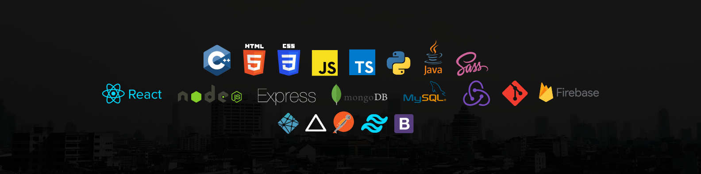

<meta name="description" content="Vineet's Github profile">
<meta name="keywords" content="Full Stack Developer, GitHub Stats, GitHub Profile, JavaScript, TypeScript, React, Nodejs, HTML5, CSS3, Bootstrap, Python, C#, C++, C, Java, PHP, PostgreSQL, MySQL, MongoDB"/>

💫 About Me:

- 👋 Hi, I am Vineet Singh Chauhan.
- 🚀 A passionate FullStack developer, creative coder and learner.
- 🔥I make it my mission to translate user-focused designs into pixel-perfect websites or applications that run blazing fast.
- 👯 I’m looking to collaborate on Web Projects.
- 🌱 Currently open for open-source contributions and freelancing opportunities.
- 📫 How to reach me **vineetksc@gmail.com**
- 🔗 Let's connect on 

      
<strong>Skills & Technologies</strong>

  

       
      
      
      
      
      
      
      
      
      
      
      
      
      
      
      
      
      
      
      
      
      
      
      
  

 
   
<strong>Social Media & Coding Profile</strong>

  

    
    
    

  

   
  
  

  

